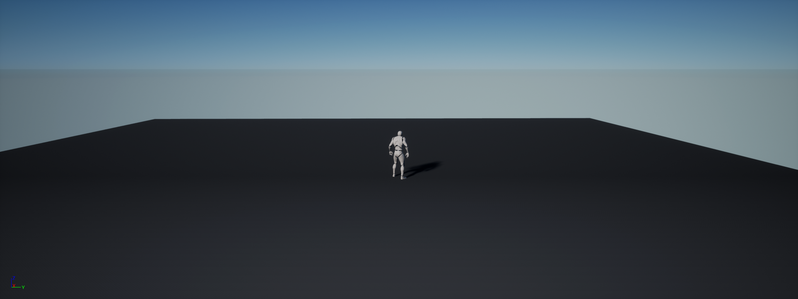
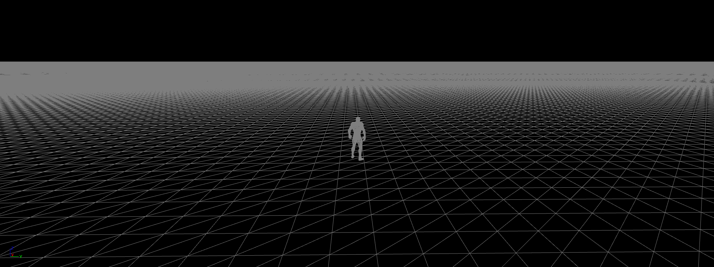
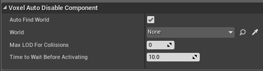

Collisions
==========

The Voxel World have 2 collision systems:

* One for players
* One for everything else

Collisions around players
-------------------------

Additional meshes are spawned around players (through their Voxel Invoker). Those meshes are used only for collision, and are computed on their own thread. In multiplayer, they also allow to have collisions under all players, no matter their position.

To see those meshes, you need to tick **Debug Collisions** in the Voxel World details, and to set the Voxel World material to a transparent one.

Other collisions
----------------

The chunks with a LOD <= **Max Collisions LOD** will have their collision computed. This setting is under *Voxel World/Collisions*.

Those collisions are useful for raytracing, or for instance to make asteroids collide in the demo.

How to make a custom object collide
-----------------------------------

To make an object collide, you have 2 options:

* Add a **Voxel Invoker** to it, and tick only **Use for Collisions**, leaving **Use for LOD** unticked. This is useful for fast objects, however it's expensive.
* Add a **Voxel Auto Disable Component** to it. This will disable its physics if it goes on a chunk without collisions.

This component has 4 parameters:

**Auto Find World:** Leave this ticked, unless you want to specify the Voxel World manually (if you have multiple Voxel Worlds for instance)

**World:** If *Auto Find World* isn't ticked

**Max LOD For Collisions:** The physics will be disabled if *CurrentLOD* > Min(*Max LOD For Collisions*, *World->Max LOD For Collisions*). You should leave that to 0, as collisions might be incoherent for higher LOD.

**Time to Wait Before Activating:** Add a delay before reactivating the physics. If your object falls through the world, increase this.

