============
Voxel Graphs
============

----
Goal
----

The goal of voxel graphs is to create procedural worlds without using C++ and with fast iteration times - in other words, no compilation.
To generate a voxel world, the densities of millions of voxels need to be queried. Blueprints are way too slow to do that.
That's why a custom graph system optimized for procedural world generation was created.

------------
How it works
------------

A voxel graph is similar to a blueprint graph: it has execution flows and data flows.
The execution flow start on the **Start** node:

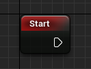

The graph is called for every voxel. To get the current voxel position, you can use the **X**, **Y** and **Z** nodes.

.. note::
    The coordinates are always integers, but for convenience these nodes output floats

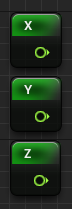

During the execution flow, you need to set two outputs:

* **Value Output**: this is the density of the current voxel. Clamped between -1 and 1
* **Material Output**: this is the material of the current voxel

To do so, you have access to the following nodes:

* **Set Value** for the density
* **Set Color**/**Set Index**/**Set Double Index** for your material depending on your voxel world material config

These are the basic outputs. Voxel graphs can also output custom values, as it will be detailed in the following sections.

-----------
Quick Start
-----------

^^^^^^^^^^^^^^^^^^^^^
Creating a flat world
^^^^^^^^^^^^^^^^^^^^^

* Add a **Set Value** node:

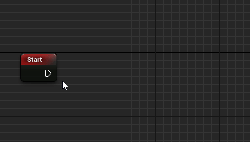

* Link a **Z** node to it:

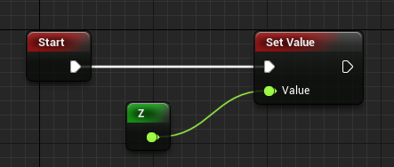

.. tip::
    To add a X/Y/Z node, hold the corresponding key and click on the graph

The density will be negative when Z < 0, and positive when Z > 0.
As a negative density corresponds to a full voxel, this is what we want.

You can now set your voxel world **World Generator** property to **Object** and set its value to your graph.
You should see a flat world.

.. note::
    Make sure that your character has a **Voxel Invoker Component**

^^^^^^^^^^^^^^^^^^^^^^^
Adding some hills to it
^^^^^^^^^^^^^^^^^^^^^^^

For the hills, we're going to use perlin noise:

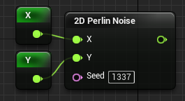

This will give us a height. However noise output is between -1 and 1: this is too small for hills!
Let's multiply it by a **Float Constant** node:

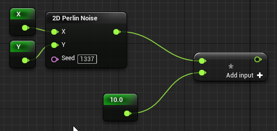

We might want to control the hills height from blueprint. Let's expose the constant:

* Click on the constant node
* On the detail panel on the left, apply the following settings:

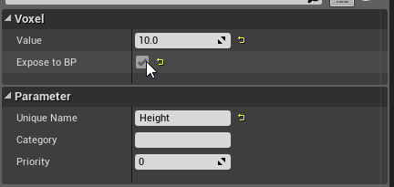

* Your node should now look like that:

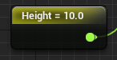

We want to have a positive density (empty) when Z > height, and a negative one (full) when Z < height.

We could do it that way:

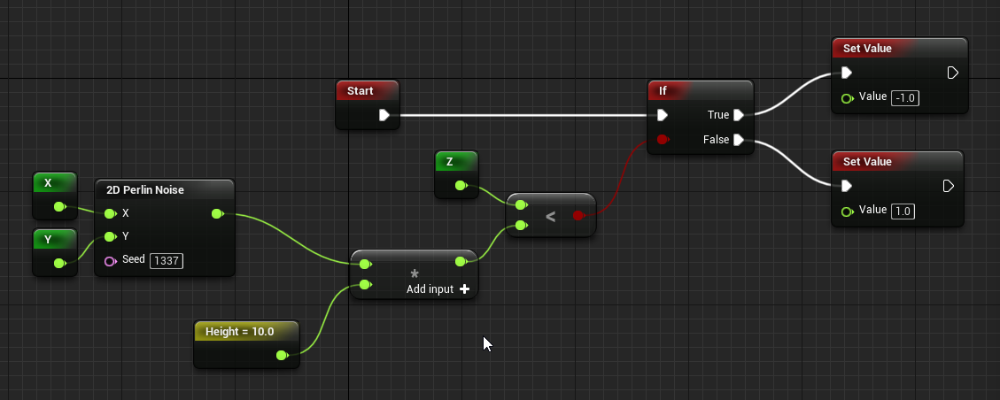

However, this would lead to bad looking terrain:

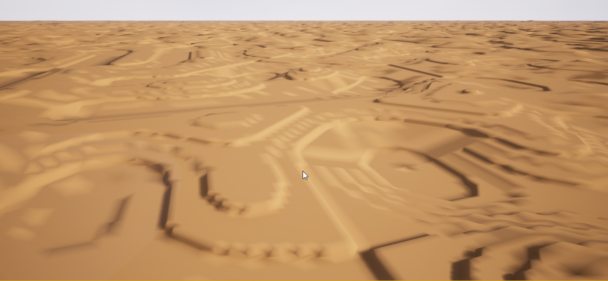

.. caution::
    Using ifs to switch between densities will create discontinuities

Instead, we're going to subtract the height from the Z value:

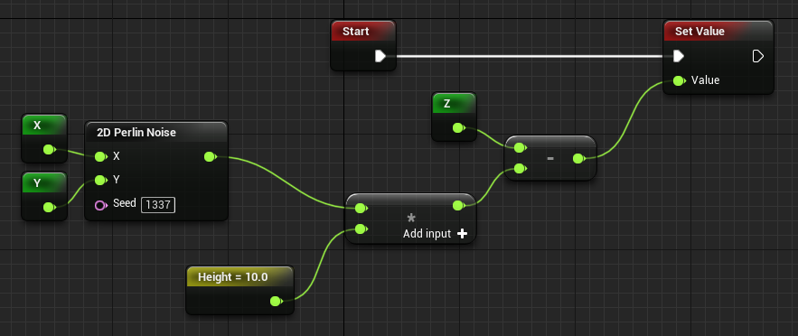

That way, we still have a positive density when Z > height and a negative one when Z < height, but without any discontinuities!

.. important::
    Make sure you understand the graph above. This is a recurring pattern when using voxel graphs

This gives the following terrain:

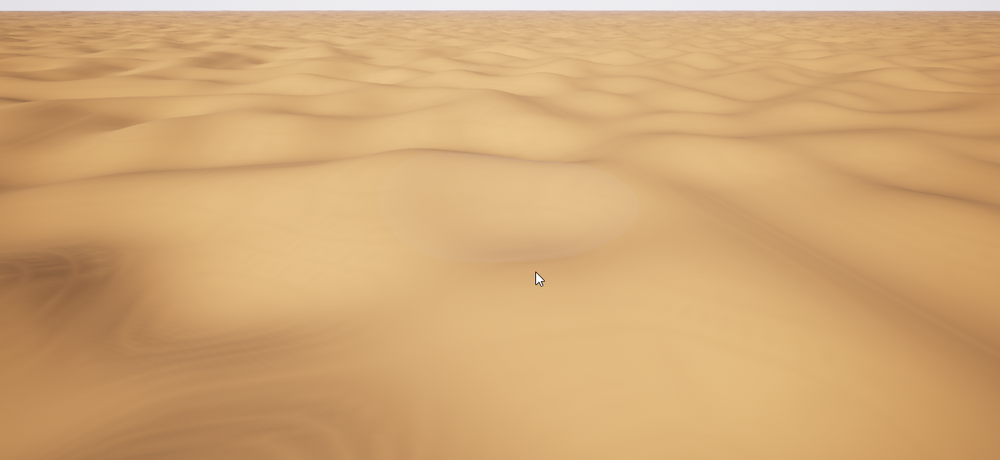

^^^^^^^^^^^^^^^^^
Adding some color
^^^^^^^^^^^^^^^^^

First of all, as we're going to reuse the noise output, we're going to add a local variable.
Local variables are only syntaxic sugar - the pins are linked together in a precompiler pass - but they can clean a lot voxel graphs.

* Right click in the voxel graph and select **Create Local Variable**
* Select the new node
* In the detail panel on the left, set its name to **Height** and its type to **Float**
* Link the perlin noise output to it, and replace its usage by a new **Height** node:

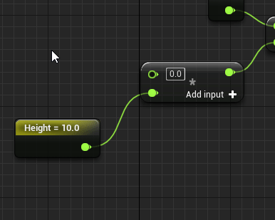

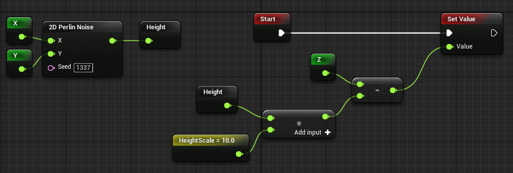

.. note::
    The **Height** constant was renamed to **HeightScale** to avoid ambiguity

**RGB Config**

Set your voxel world **Material Config** property to **RGB**, and the **Voxel Material** property to **M_VoxelMaterial_Colors**.

.. note::
    If you don't find the material make sure **Show Plugin Content** is enabled in the *View Options* dropdown menu of the selector

Add the following nodes:

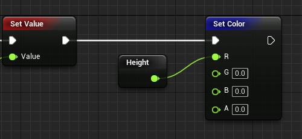

Your world should now look like this:

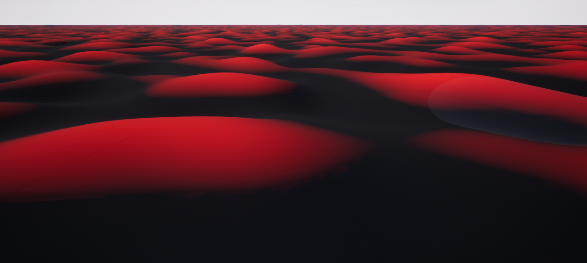

**Single Index Config**

Set your voxel world **Material Config** property to **Single Index**, and the **Material Collection** property to **ExampleCollection**.

Add the following nodes:

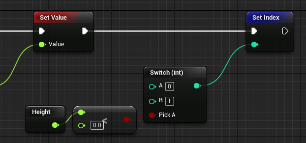

Your world should now look like this:

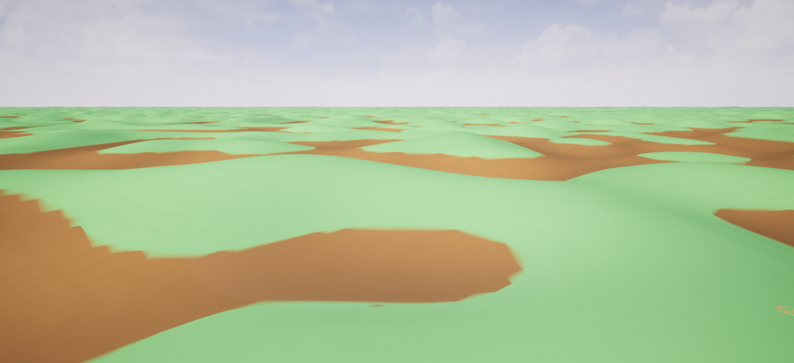

Notice how while there is a blending, it's far from perfect.

**Double Index Config**

Set your voxel world **Material Config** property to **Double Index**, and the **Material Collection** property to **ExampleCollection**.

Add the following nodes:

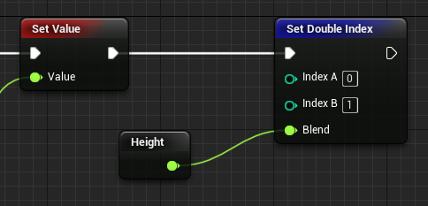

Your world should now look like this:

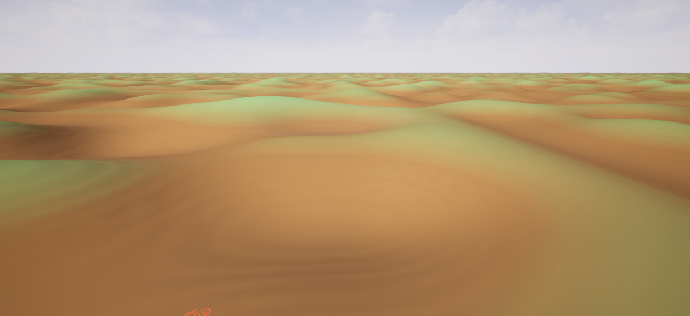

Notice how smooth the blending is. If you want a smaller blending distance:

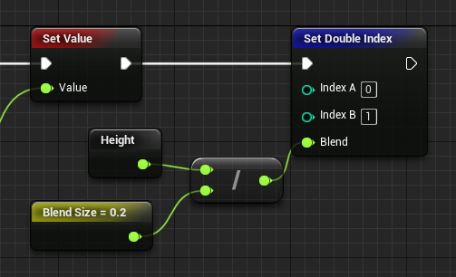

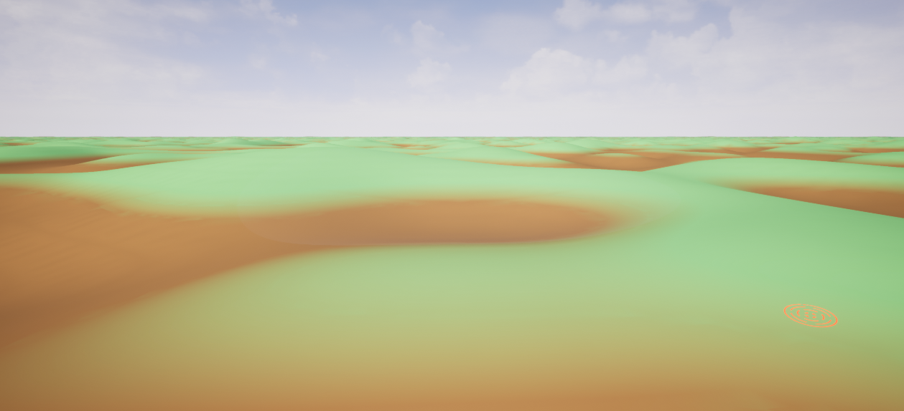
