Importers
=========

To convert an asset to a voxel one, you need to use a *Voxel Importer*.
To use an importer, drag and drop it to your scene from the **Voxel** section of the **Modes** tab

.. image:: img/quickstart_modes.png

Heightmap Importer
------------------

* Drag and drop a **Heightmap Importer** to your scene
* Set the **Heightmap** property, and add your weightmaps. Make sure you set a different material for every weightmap, else they'll be merged. If there are more than 2 weightmaps, only the 2 with the highest alpha will be used per pixel.
* Set the save path, relatively to your Content directory, and the save name
* Click Create

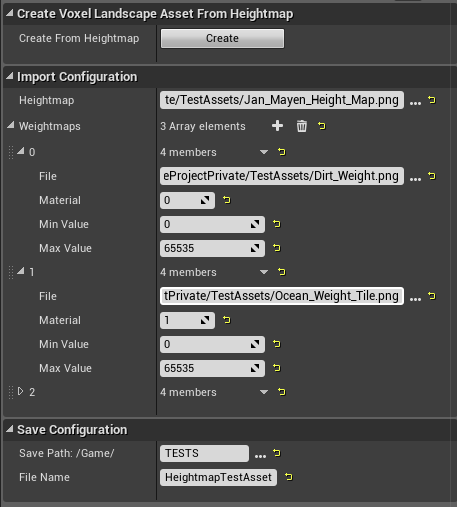

Landscape Importer
------------------

The landscape importer get the height values directly from the UE Landscape actor, allowing for a perfect match.

* Drag and drop a **Landscape Importer** to your scene
* Set the **Landscape** property, and add the layer infos of your landscape. Make sure you set a different material for every layer, else they'll be merged. If there are more than 2 layers, only the 2 with the highest alpha will be used per pixel.
* Set the save path, relatively to your Content directory, and the save name
* Click Create

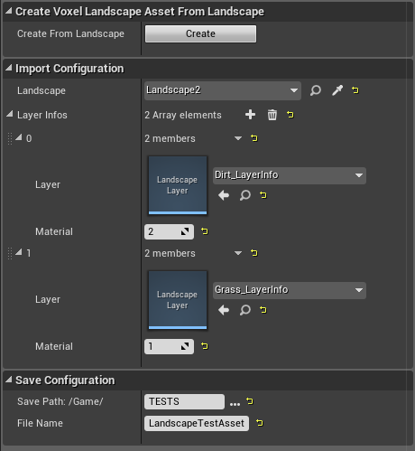

MagicaVoxel Importer
--------------------

For now, only one pack per file is supported.

* Drag and drop a **MagicalVoxel Importer** to your scene
* Set the path to your .vox
* Set the save path, relatively to your Content directory, and the save name
* Click Create

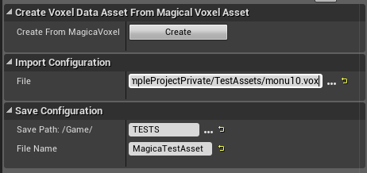

Mesh Importer
-------------

The mesh importer works in 3 steps:

* The mesh is voxelized with cubic voxels at a high resolution. This creates a shell
* A flood fill algorithm is applied, starting from given positions
* Those voxels are smoothed by scaling down the model

The size of the cubic voxels is set by **Mesh Voxel Size**.

The amount of smoothing is set by **Upscaling Factor** : this is the size of the final voxels in cubic voxels.
For instance, in the image below, the big cube is the final voxel, while the small ones are the cubic voxels. The upscaling factor here is 4.

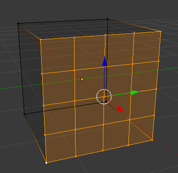

* Drag and drop a **Mesh Importer** to your scene
* Set the **Static Mesh** property
* Rotate and scale the importer actor if needed
* Set the material of the voxel asset to Create
* Set the **Mesh Voxel Size** and **Upscaling Factor**
* For every part of your mesh not connected to the others, add an actor inside it, and add this actor to the **Actors Inside the Mesh** array
* Set the save path, relatively to your Content directory, and the save name
* Click Create

**Tip #1:** if you want to see the cubic voxels, tick **Draw points** in the *Debug* category. Don't enable it if you resolution is too high, as it will make the editor lag.

**Tip #2:** if the voxel asset is an empty shell, add more actors to **Actors Inside the Mesh**

**Tip #3:** use the top/left/right views

Original mesh:

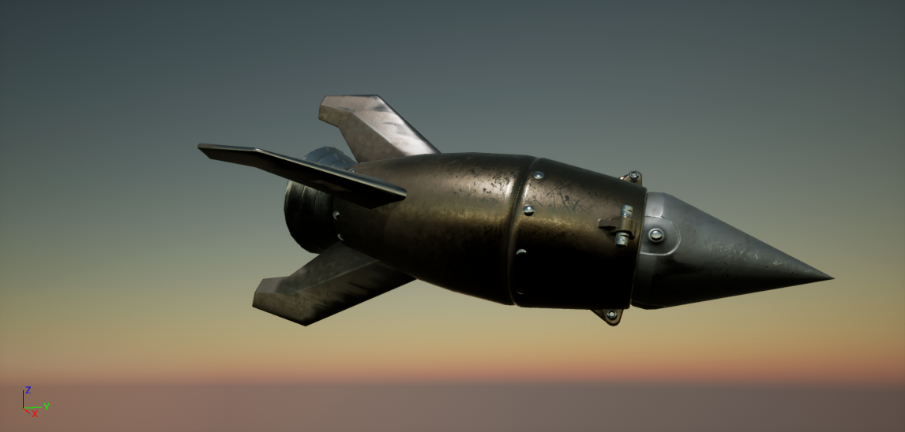

Position of the actors (in white):

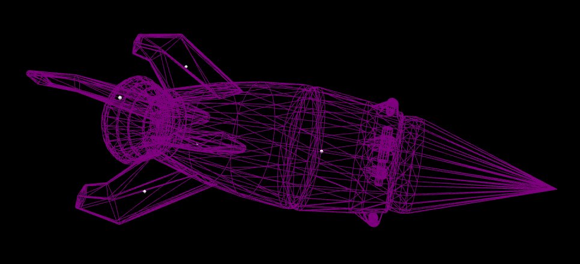

Mesh Voxel Size = 25, Upscale = 2

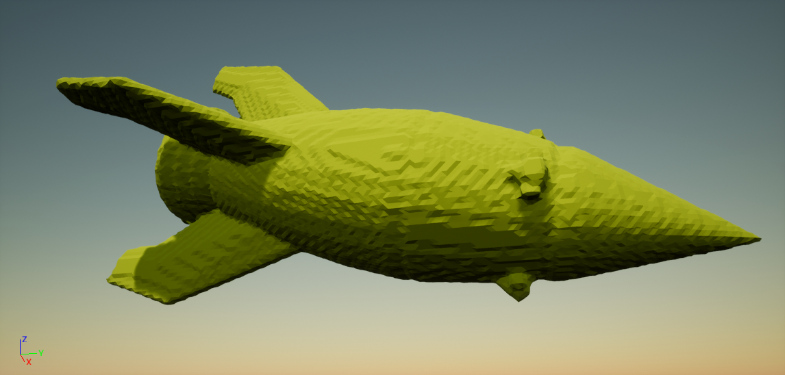

Mesh Voxel Size = 25, Upscale = 4

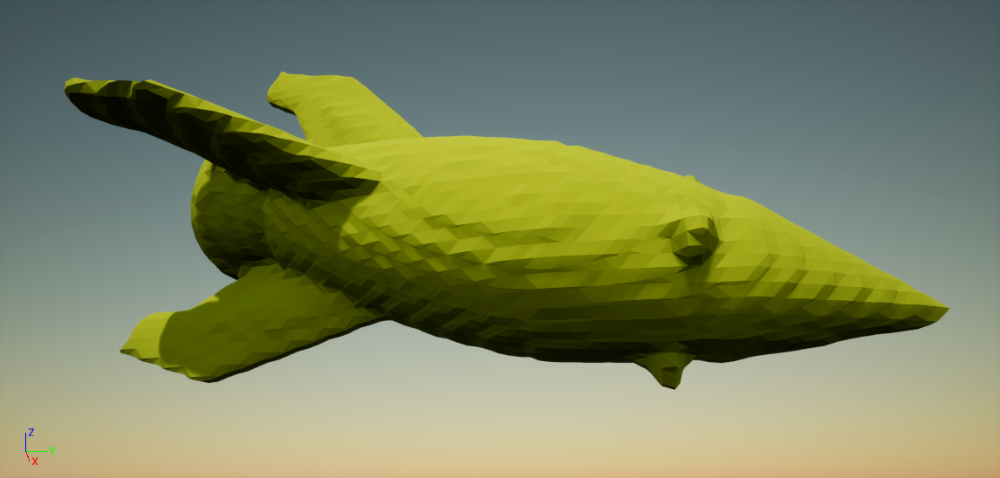

Mesh Voxel Size = 25, Upscale = 8

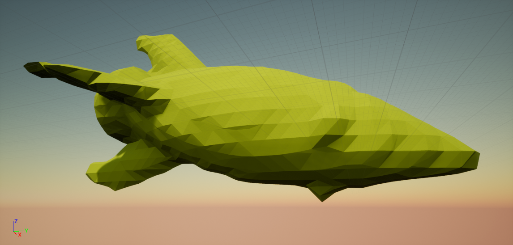

Mesh Voxel Size = 100, Upscale = 2

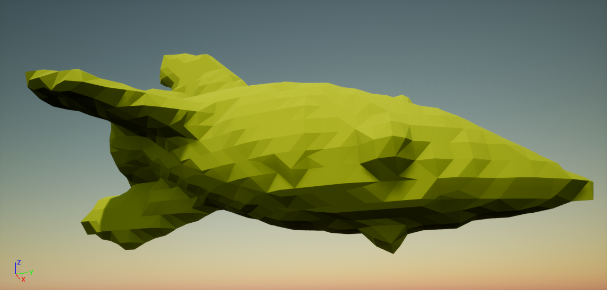

.. image:: img/importers_mesh.png

3D Coat Importer
----------------

`3D Coat`_ is a 3D modeling program using voxels. It can export a voxel mesh to a .rawvox.

.. _3D Coat: https://3dcoat.com/home/

* Drag and drop a **RawVox Importer** to your scene
* Set the path to your .rawvox
* Set the save path, relatively to your Content directory, and the save name
* Click Create

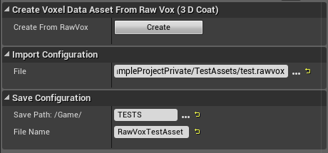

Spline Importer
---------------

This allows to create a voxel asset from splines, which can be useful for caves for instance.

* Drag and drop a **Spline Importer** to your scene
* Add an element to the **Splines** array by clicking the + button
* Double click the wireframe sphere to focus it
* Set the nodes (white points) positions. You can duplicate a node by pressing *Alt* and moving it
* To set the spheres scale, scale the nodes on their Y (green) axis
* Once you've finished editing a component, you can add another
* If you want the asset to have a material, tick **Set Material** and set the material values
* Set the **Voxel Size** property
* Set the save path, relatively to your Content directory, and the save name
* Click Create

**Warning:** don't make the splines too big, as it might freeze/crash the editor

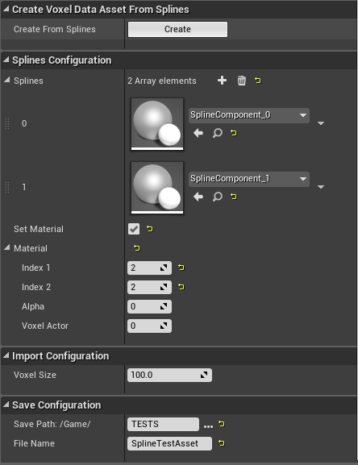

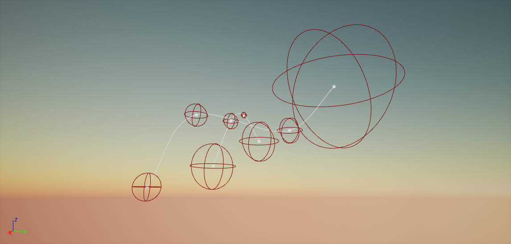

.. image:: img/importers_spline_after.png

World Section Importer
----------------------

This allows you to save a section of a world edited in PIE.

* Launch PIE, and make your edits
* Drag and drop a **World Section Importer** to your scene
* Set the **World** property
* *(Optional)* Add 2 actors to your scene, and position one at the top of your section, and the other at the bottom
* *(Optional)* Set the **Top Actor** and **Bottom Actor** properties, and click **Copy Actors Positions To Corners**
* You should see red lines delimiting your section. You can adjust your section by modifying the **Top Corner** and **Bottom Corner** properties
* Set the save path, relatively to your Content directory, and the save name
* Once you're happy with the section, click Create

**Tip:** use the top/left/right views

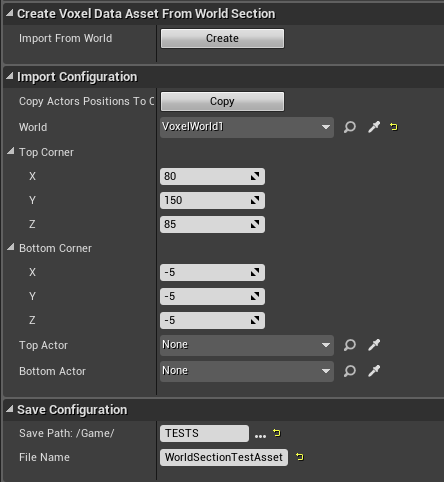

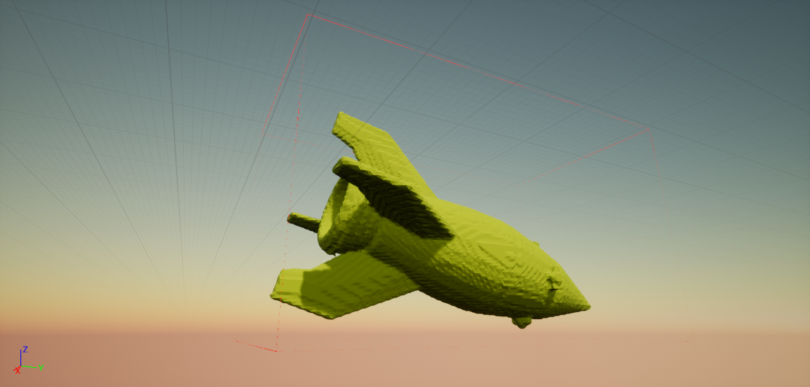

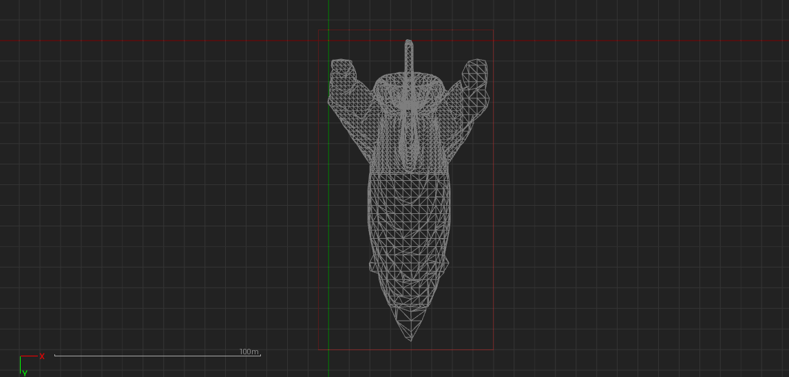