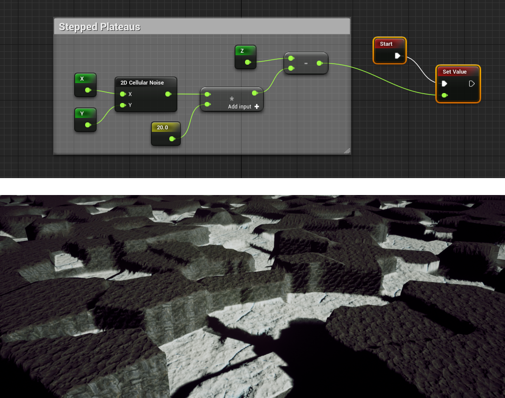
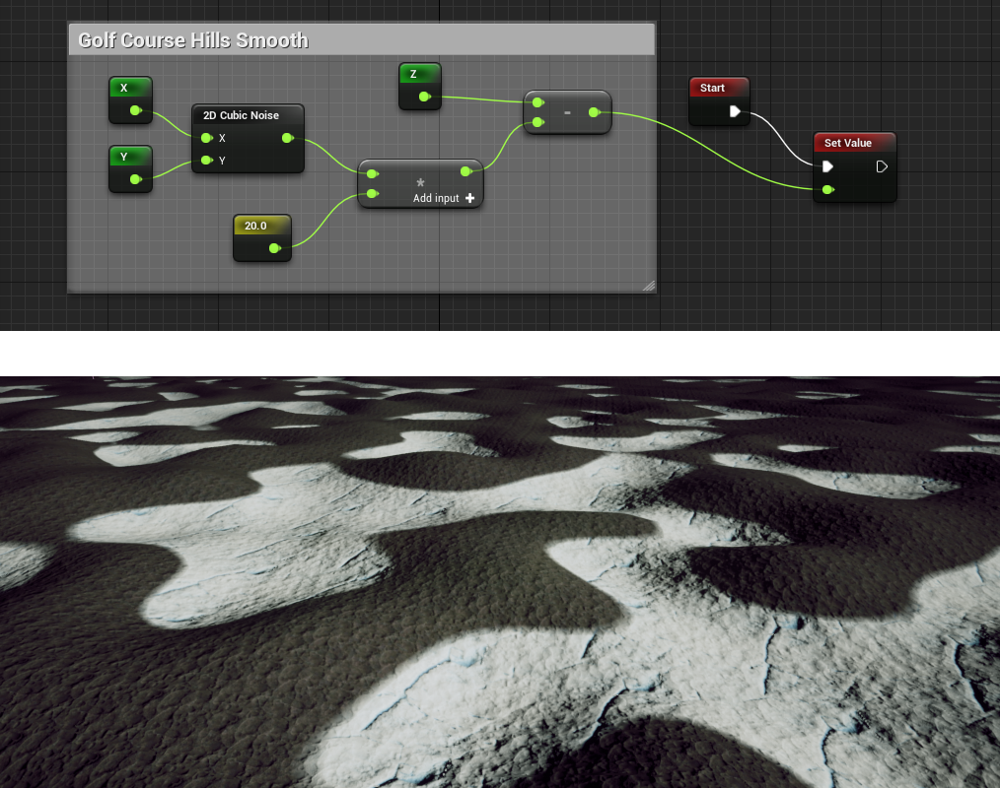
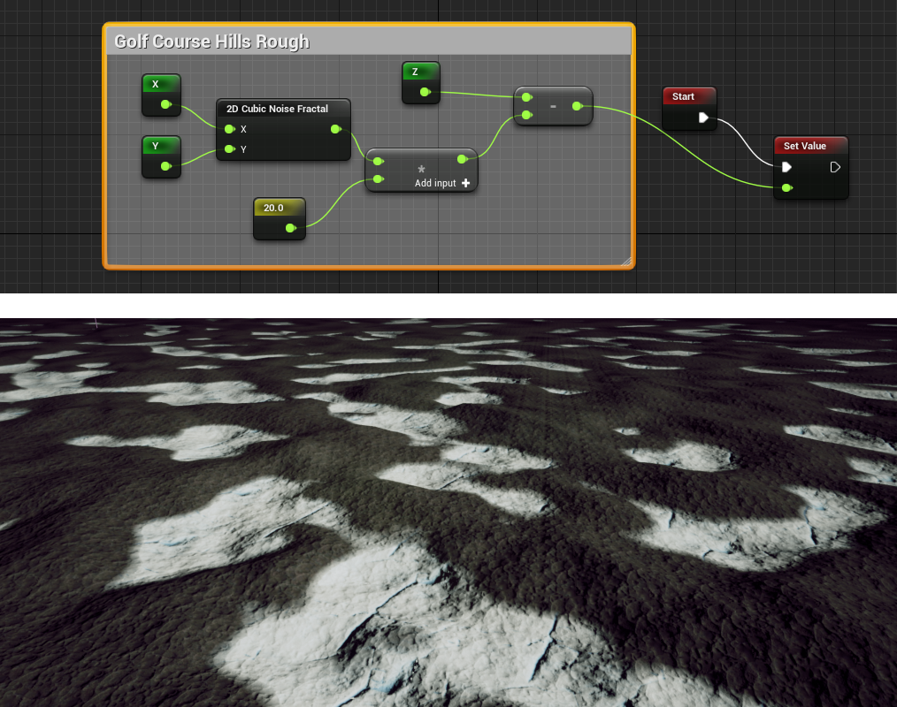
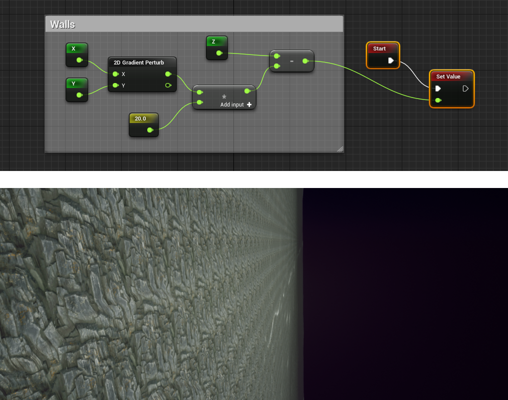
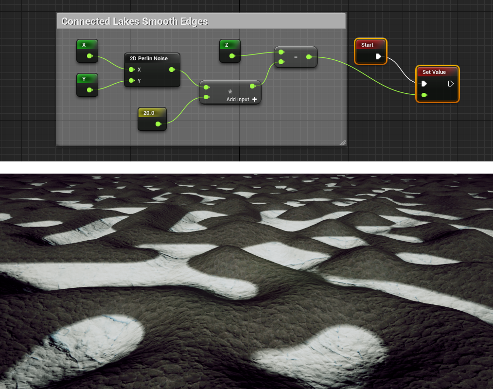
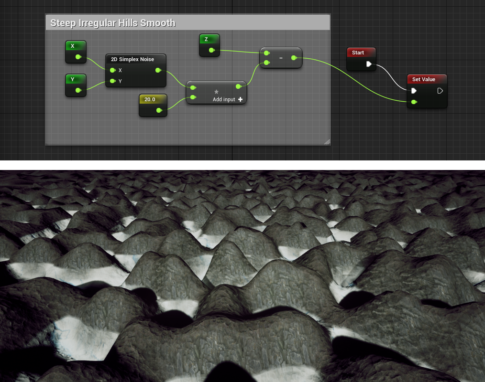
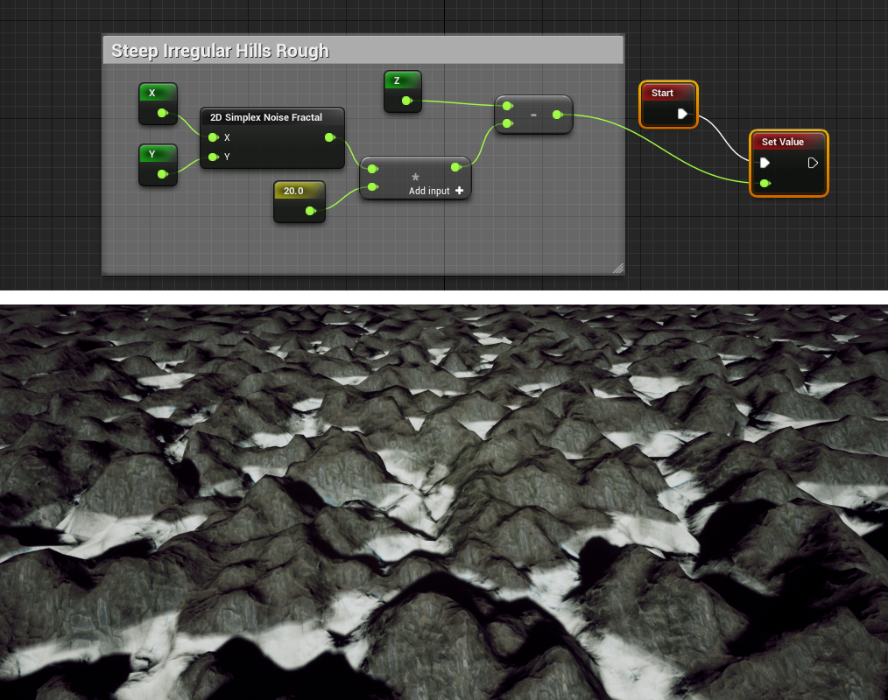
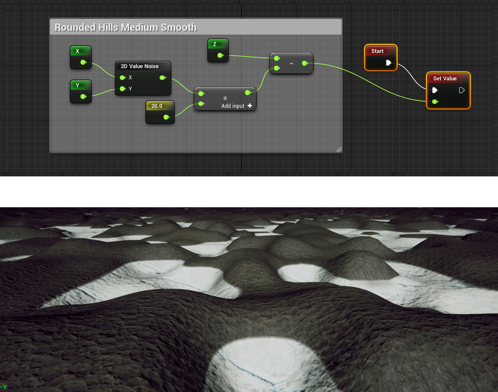
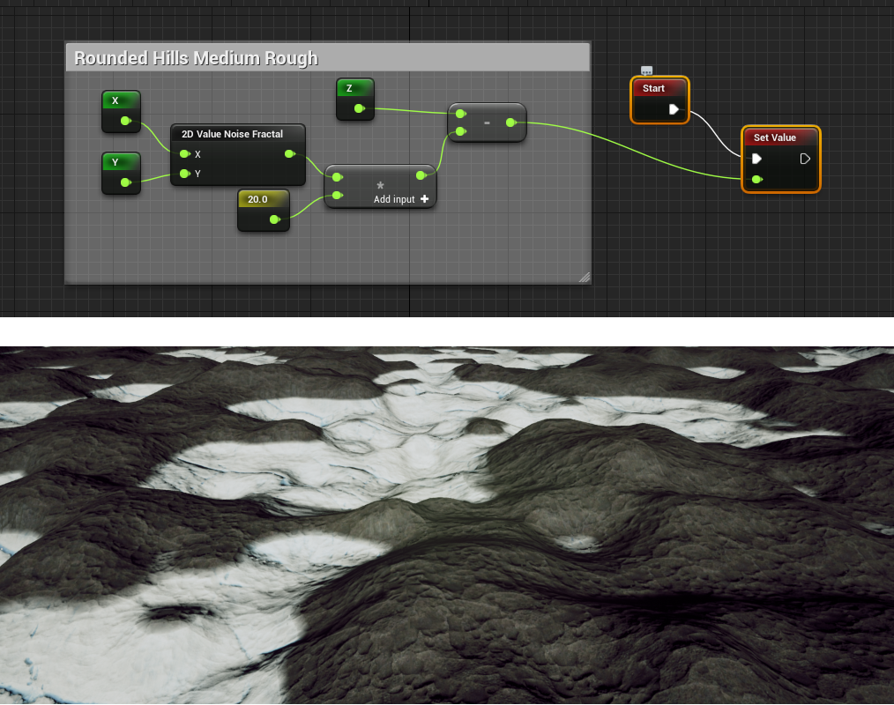

Noise Nodes
===========

For more info on noise, you can check `this website`_.

.. _this website: http://www.neilblevins.com/cg_education/procedural_noise/procedural_noise.html

2D Cellular Noise (Stepped Plateaux)
------------------------------------

2D Cubic Noise (Golf Course Hills Smooth)
-----------------------------------------

2D Cubic Noise Fractal (Golf Course Hills Rough)
------------------------------------------------

2D Gradient Perturb (Vertical Wall)
-----------------------------------

2D Perlin Noise (Connected Lakes Smooth Edges)
----------------------------------------------

2D Perlin Noise Fractal (Connected Lakes Rough Edges)
-----------------------------------------------------

.. image:: img/noise/2d-perlin-noise-fractal.png

2D Simplex Noise (Steep Irregular Hills/Mountains Smooth)
---------------------------------------------------------

2D Simplex Noise Fractal (Steep Irregular Hills/Mountains Rough)
----------------------------------------------------------------

2D Value Noise (Rounded Hills Medium Smooth)
--------------------------------------------

2D Value Noise Fractal (Rounded Hills Medium Rough)
---------------------------------------------------

2D White Noise (Sharp Tall Spikes)
----------------------------------

.. image:: img/noise/2d-white-noise.png