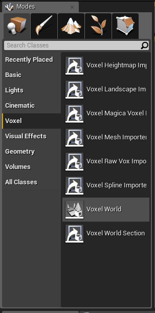
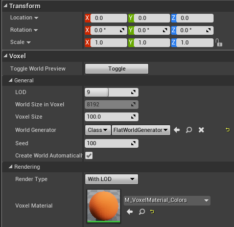
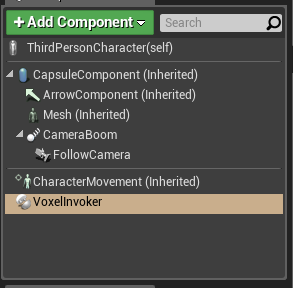
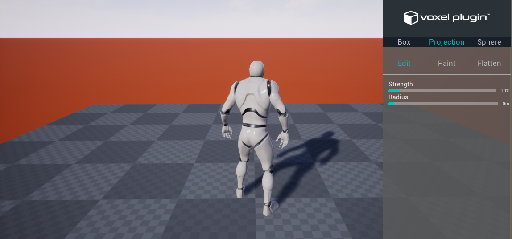

Quick start
===========

* From the Modes panel, drag and drop a Voxel World actor in your scene, and set its location to (0, 0, 0)

* In the Voxel World details panel, under *Voxel/General*, set the world generator to **Class** and **FlatWorldGenerator**
* Under *Voxel/Rendering*, set the Voxel Material to **M_VoxelMaterial_Colors** (make sure that "Show Plugin Content" is ticked under View Options)

* Add a **Voxel Invoker Component** to your pawn (for instance the ThirdPersonCharacter pawn). This component is used by the plugin to adjust the LOD, and to create collisions around players

* If you don't already have a Game Mode, `create one`_ and set the default pawn
    
.. _create one: https://docs.unrealengine.com/latest/INT/Gameplay/HowTo/SettingUpAGameMode/Blueprints/

* Set the Player Controller to **BP_VoxelPlayerController**

* Play. The voxel world should appear, along with the UI

