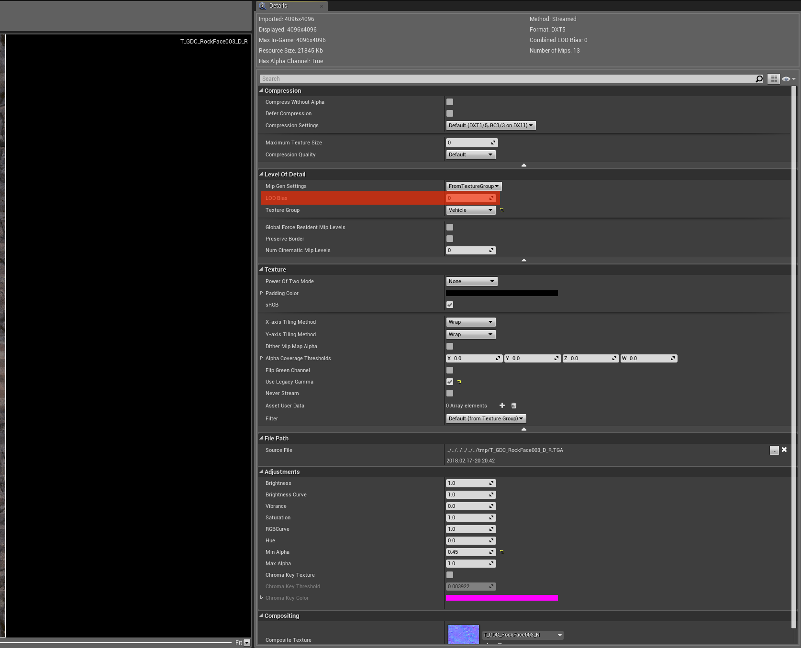

Texture Arrays
==============

.. raw:: html

    
<iframe src="https://www.youtube.com/embed/oteNqCsUT88?rel=0" frameborder="0" allowfullscreen></iframe>

    

Getting the Texture Arrays engine build
---------------------------------------

You have 2 ways to get a Texture Array build:

Building from source
~~~~~~~~~~~~~~~~~~~~

Apply `this tutorial`_ to the `texture arrays engine fork`_ (make sure you are using the *4.18.2-TextureArrays* branch).

.. _this tutorial: https://docs.unrealengine.com/en-us/Programming/Development/BuildingUnrealEngine
.. _texture arrays engine fork: https://github.com/Phyronnaz/UnrealEngine/tree/4.18.2-TextureArrays

Downloading a binary build
~~~~~~~~~~~~~~~~~~~~~~~~~~

If you don't want to build the engine from source, you can also download a binary build `on the github`_.

**If you get a 404 error**, you need to link your github account to your Epic Games account (`tutorial`_).

Once downloaded, extract the 7zip and launch **UnrealEngine_4.18_TextureArrays/Windows/Engine/Binaries/Win64/UE4Editor.exe**.

.. _on the github: https://github.com/Phyronnaz/UnrealEngine/releases
.. _tutorial: https://www.unrealengine.com/en-US/ue4-on-github

Using the build
---------------

* Download the **Texture Arrays Voxel Plugin build**.
* If you already have a Voxel World, remove it.
* Add a **VoxelWorld_TextureArrays** to your scene (Voxel Content/TextureArrays)
* Set the **Path**, **Diffuse Suffix** and **Normal Suffix** parameters. The blueprint will look recursively under *Path* for textures ending by *Diffuse Suffix*. For each texture found, it'll check if there's a texture with the same prefix ending by *Normal Suffix*. **WARNING:** All textures in the same array (diffuse array or normal array) must have the same resolution and the same pixel format. Check the output log for errors. To change a texture resolution, you can use **LOD Bias**:

* Hit play. If you have a lot of textures, the loading can be a bit long.
* Check the output log for errors.
* The textures should appear in the UI:

.. image:: img/texturearrays_result.png
