Voxel Graph
===========

.. raw:: html

    
<iframe src="https://www.youtube.com/embed/M3D0rg2IFqM?rel=0" frameborder="0" allowfullscreen></iframe>

    
.. raw:: html

	

.. raw:: html

    
<iframe src="https://www.youtube.com/embed/HJNErlOr7xk?rel=0" frameborder="0" allowfullscreen></iframe>

    
.. raw:: html

	

.. raw:: html

    
<iframe src="https://www.youtube.com/embed/7267NvtKyts?rel=0" frameborder="0" allowfullscreen></iframe>

    
.. raw:: html

	

.. raw:: html

    
<iframe src="https://www.youtube.com/embed/QGVgYMfVFAg?rel=0" frameborder="0" allowfullscreen></iframe>

    
.. raw:: html

	

A *Voxel Graph* is a world generator that is created through a Blueprint-like graph.
It can be used in 2 ways:

* Interpreted mode: no compilation, ideal for fast iteration times. Can be a bit slower
* Compiled mode: compiles the graph to C++, should be done once you're happy with the result. It's native C++, so it's *really* fast

Creating a basic Voxel Graph
~~~~~~~~~~~~~~~~~~~~~~~~~~~~

* Right click in your Content Browser, and select **Voxel/Voxel Graph**. Name it *MyGraph*
* Open it by double clicking it

You should see a graph with only a *Start* node. This is where the execution starts.
To set the world generator outputs, you need to use the following nodes:

* **Set Value** to set the density
* **Set Material** to set the material
* **Set VoxelType** to set the voxel type (used to merge worlds)

In the graph, do the following:

* Drag the exec pin of the *Start* node. It's context sensitive, so you only see nodes with an exec input.
* Choose a **Set Value** node. This node has one float input, the **density**.
* Drag the float input of the *Set Value* node, and choose **Z (float)**. This node returns the Z position in voxel space. This position is an int, but has been converted to float for convenience.

You should have the following graph:

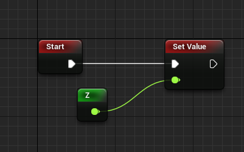

* In your Voxel World details, set the type to **Object**, and the generator to **MyGraph**

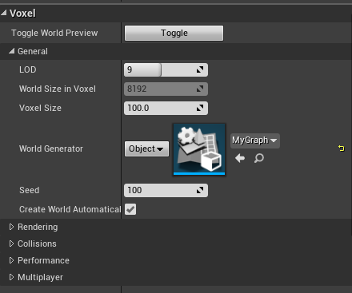

* Hit Play. You should see a flat world.

Adding noise
~~~~~~~~~~~~

A flat world is boring. Let's add some mountains!

Add the following nodes:

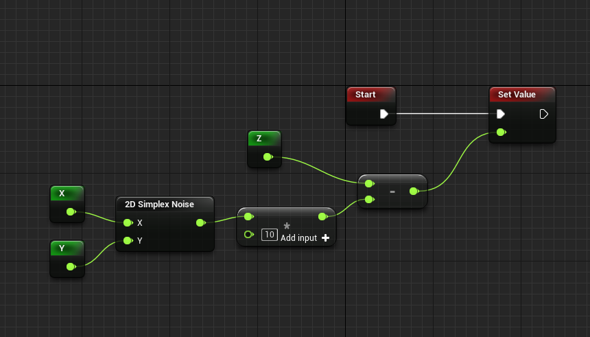

This will make some hills:

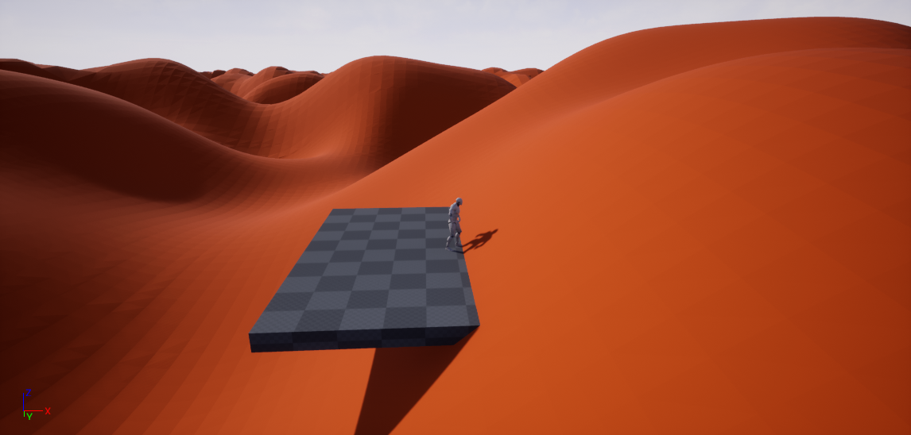

To make mountains, we need to increase the scale, and clamp the values to have some flat ground.

Make the following graph:

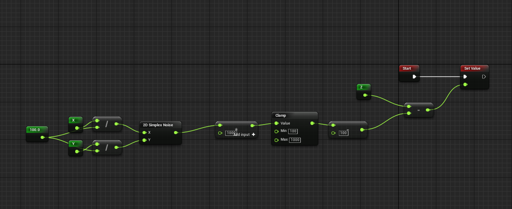

* First, X and Y are divided by 100 to make the hills XY scale bigger. You can also set the *2D Simplex Noise* **scale** property to 100 to achieve the same result
* Then, the noise value - which is between -1 and 1 - is multiplied by 1000 and clamped between 100 and 1000. This allows to select only a part of the hills. Substracting 100 set the ground height back to 0.

This will make the following world:

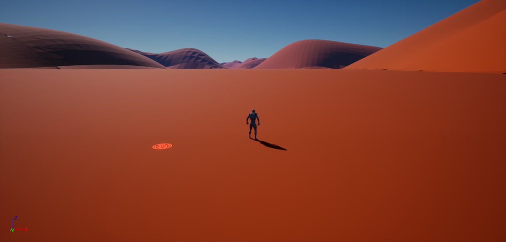

You might need to remove the sky sphere, and set the Voxel World **LOD** to 19 to see the mountains in the background.

Optimizing the graph
~~~~~~~~~~~~~~~~~~~~

For now, the noise is computed for every position in the world. However, a voxel world is a cube: this means that it goes *really* high, and *really* deep.
But the density for Z < 0 and for Z > 1000 is already known: -1 if Z < 0, and 1 if Z > 1000.
To improve the performance, we can add *If* nodes to check if Z < 0 or Z > 1000:

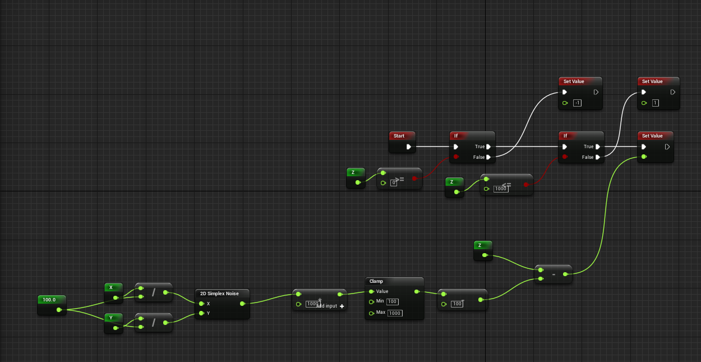

Adding colors
~~~~~~~~~~~~~

A *Voxel Material* is defined by 3 values:

* 2 materials index (A and B)
* an alpha

The final material is Lerp(A, B, alpha).

To smoothly change materials based on height, do the following:

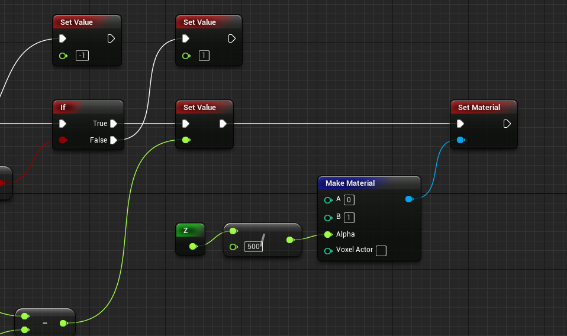

This will make the top of the mountains yellow:

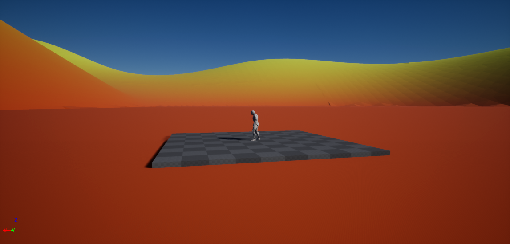

Compiling to C++
~~~~~~~~~~~~~~~~

* If your project isn't a C++ project, add a new C++ class
* In your voxel graph, click **Compile to C++** in the top bar
* If you get one of the following popups, click **Yes**

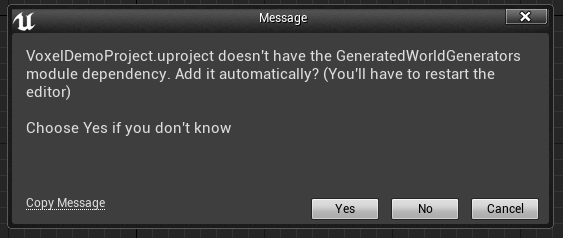

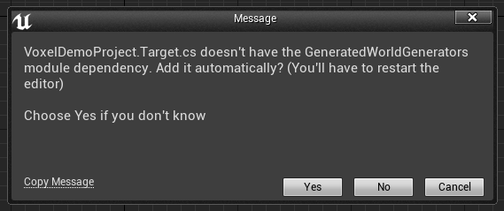

* Click **Save** in the Windows popup, leaving the default location and Name
* If you had one of the above popups, restart the editor. If you get a *Would you like to rebuild them* popup, click **Yes**
* Click **Compile** on the left of the Play button
* Wait for the compilation to end
* In your voxel world settings, set the world generator type to **Class** and the generator to **MyGraph**
* Click Play. The same world should generate, but a lot faster.

World Generator Sampling
~~~~~~~~~~~~~~~~~~~~~~~~

You can use a world generator in an other one.

* Create a new graph
* Add a **SetValue** node
* Add a **World Generator Sampler** node
* Click the node. In the details panel, set the world generator to **Class** and **FlatWorldGenerator**
* Add X, Y and Z nodes

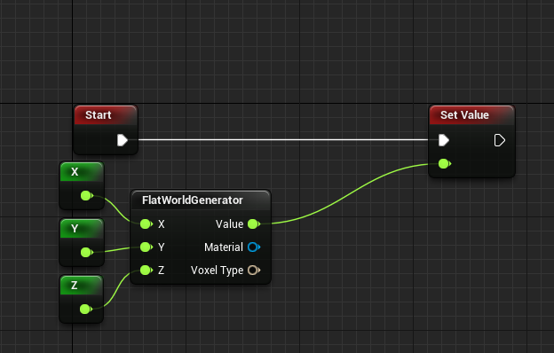

**Warning:** When compiling to C++, world generator sampler references are lost. You need to set the **Unique Name** property, and create a Blueprint subclass of the generated C++, in which you'll set the reference.

**Warning:** Creating a world generator loop (A samples B, which samples A, which samples B...) will make the editor freeze/crash!

Exposing parameters to Blueprints
~~~~~~~~~~~~~~~~~~~~~~~~~~~~~~~~~

You might want to have dynamic parameters to your world, to allow the player to create its own worlds for instance.
To do that, you can expose Voxel Graph constants to Blueprints.

* Create a new graph names **MyGraphWithParameters**
* Make the following nodes:

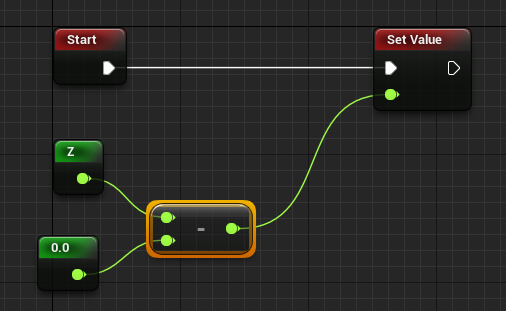

* Click the constant, and set its details like this:

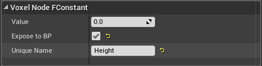

The constant node should turn yellow

* Compile the graph to C++
* Create a Blueprint subclass of *MyGraphWithParameters* (right click Content Browser, Blueprint Class, All Classes, MyGraphWithParameters), and name it **MyGraphWithParametersBP**
* Open it, and set the **Height** property to -1000:

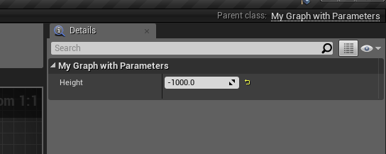

* Set the world generator in your Voxel World details to **Class/MyGraphWithParametersBP**. You should see the ground far below you:

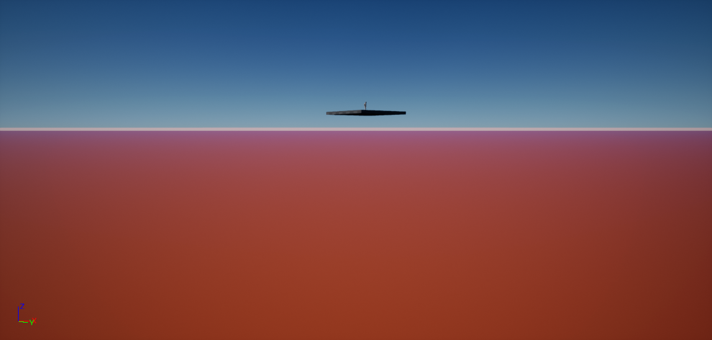

You can also spawn a new world generator at runtime:

* Click **Blueprint/Add Script** on the Voxel World
* Set the **BeginPlay** event like this:

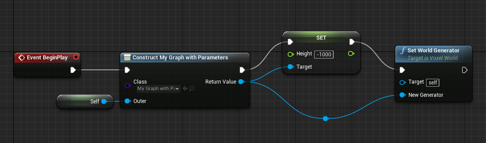

The result should be the same as creating a Blueprint subclass.
**Set World Generator** can be called at runtime. 
You can also use **Swap World Generator**, which allows to keep a safe zone:

.. raw:: html

    
<iframe src="https://www.youtube.com/embed/MW35r_QVYns?rel=0" frameborder="0" allowfullscreen></iframe>

    
.. raw:: html

	

