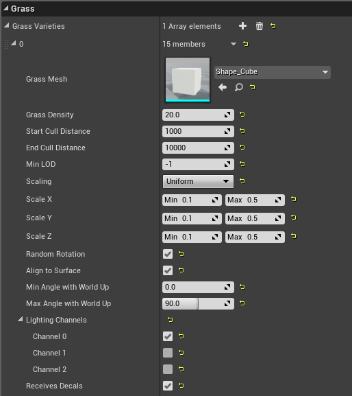
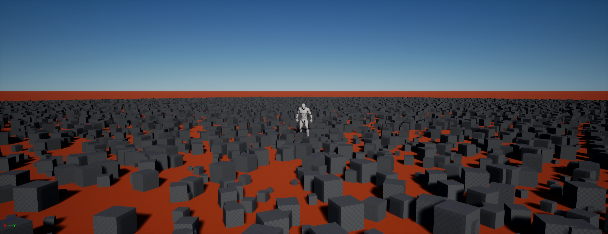
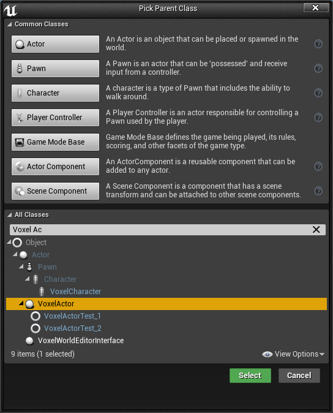
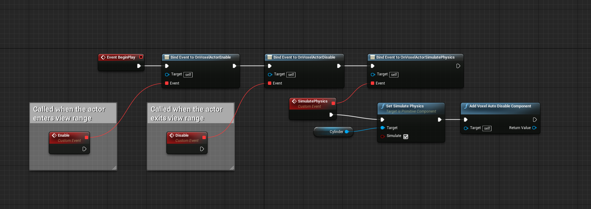
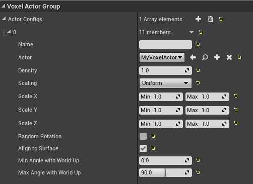
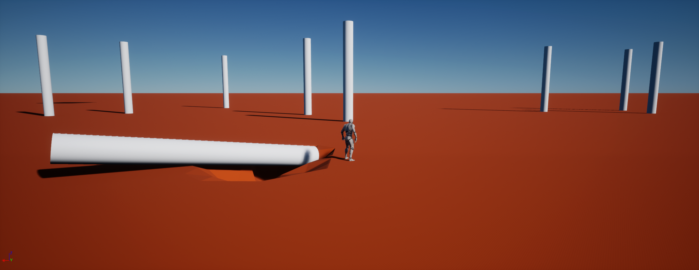

Voxel Grass and Voxel Actors
============================

The plugin has 2 spawning systems:

* One for small meshes without collisions : **Voxel Grass**
* One for actors with collisions and physics : **Voxel Actors**

Both of those systems uses the voxel meshes, so they can only work for chunks with LOD = 0.

Voxel Grass
-----------

* Create a **Voxel Grass Group** by right clicking in the Content Browser, and open it
* Configure it like below (you'll need Starter Contents for the cube)

* Create a **Voxel Grass Spawner**
* Add an element: set its **Grass Type** to the Grass Group created above, and its **Material** to 0 (this is the Voxel Material where the Grass Group will be spawned)
* Set the **Grass Spawner** property of your Voxel World to that grass Spawner
* Play. You should see cubes where your world material index is 0. If you paint another material, the cubes will disappear

Voxel Actors
------------

* Create a new blueprint inherinting from **Voxel Actor** and name it **MyVoxelActor**

* Open it. Add a **Cylinder** component and replace **DefaultSceneRoot** by it.
* Set the **Allow CPU Access** property of the Cylinder mesh to **true** via *Asset Actions/Bulk Edit*
* In the Event Graph, create the following nodes:

When *Enable* or *Disable* are called, the following are done automatically:

    * SetActorHiddenInGame
    * SetActorEnableCollision
    * SetActorTickEnabled

* Create a new **Voxel Actor Group**, and configure it like below:

* Create a new **Voxel Actor Spawner**
* Add an element, and set its group to the group created above and its ID to 0. This ID is set in the World Generator, and allows to configure where to spawn Voxel Actors
* Set the **Actor Spawner** property of your Voxel World to this spawner, and hit play. You should see cylenders, and if you dig under them they should fall.

