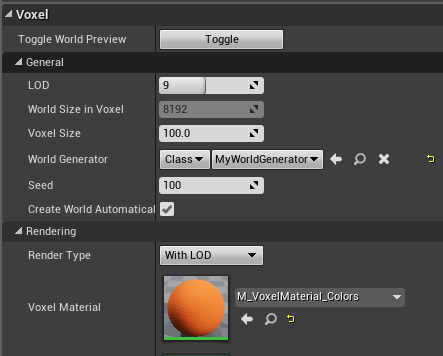
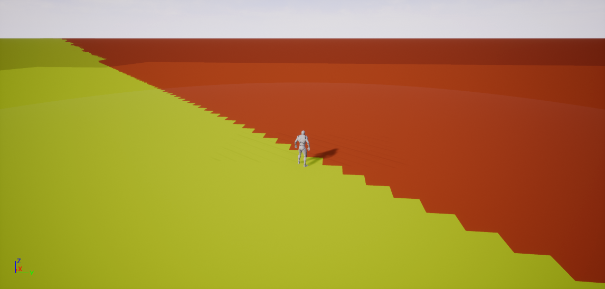
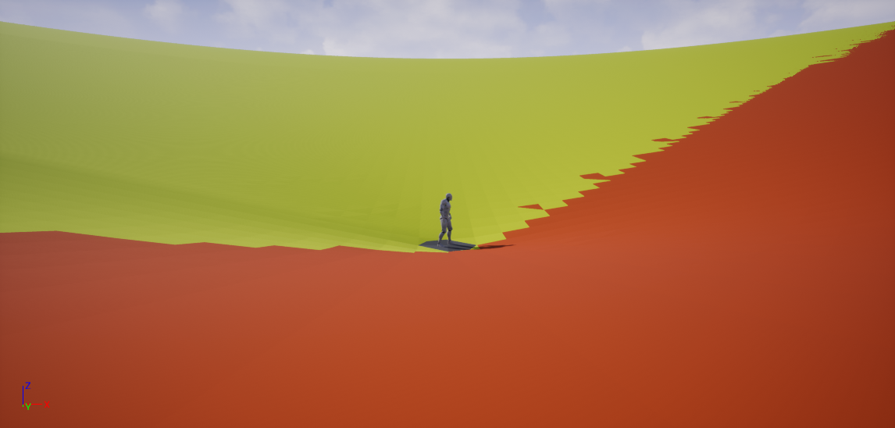
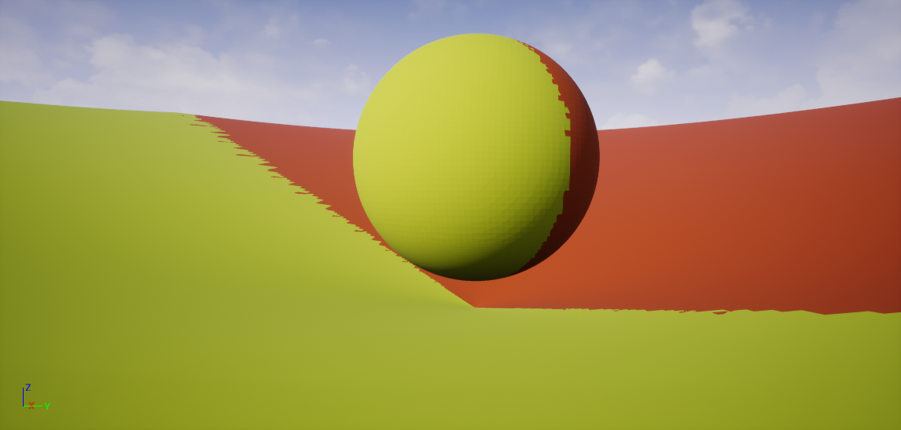

Voxel World Generator
=====================

A *Voxel World Generator* is used to generate a world. Given a position, it returns the density and the material at this position.
A position is in voxel space, and is always made of ints.
There are 2 ways to create a world generator: through C++, and through a *Voxel Graph*.

Voxel Graph
-----------

See :doc:`voxelgraph`.

C++
---

A World Generator is divided into 2 classes: an UObject inheriting from **UVoxelWorldGenerator**, used to create a **FVoxelWorldGeneratorInstance**, which is a nearly constant class where the real work is done.
This class must be constant, initialization excepted, as it will be used in multiple threads. 

1. Create a new **UObject** class inheriting from **UVoxelWorldGenerator**
~~~~~~~~~~~~~~~~~~~~~~~~~~~~~~~~~~~~~~~~~~~~~~~~~~~~~~~~~~~~~~~~~~~~~~~~~~

.. code-block:: cpp

    #include "VoxelWorldGenerator.h"

    UCLASS(Blueprintable)
    class UMyWorldGenerator : public UVoxelWorldGenerator
    {
        GENERATED_BODY()
        
    public:
        UPROPERTY(EditAnywhere)
        float MyProperty;

        //~ Begin UVoxelWorldGenerator Interface
        TSharedRef<FVoxelWorldGeneratorInstance> GetWorldGenerator() override;
        //~ End UVoxelWorldGenerator Interface
    };

2. Create a new class inheriting from **FVoxelWorldGeneratorInstance**
~~~~~~~~~~~~~~~~~~~~~~~~~~~~~~~~~~~~~~~~~~~~~~~~~~~~~~~~~~~~~~~~~~~~~~

.. code-block:: cpp

    class FMyWorldGeneratorInstance : public FVoxelWorldGeneratorInstance
    {
    public:
        FMyWorldGeneratorInstance(float MyProperty);

        //~ Begin FVoxelWorldGeneratorInstance Interface
        void SetVoxelWorld(const AVoxelWorld* VoxelWorld) override;
        FVector GetUpVector(int X, int Y, int Z) const override;
        void GetValuesAndMaterialsAndVoxelTypes(float Values[], FVoxelMaterial Materials[], FVoxelType VoxelTypes[], const FIntVector& Start, const FIntVector& StartIndex, int Step, const FIntVector& Size, const FIntVector& ArraySize) const override;
        bool IsEmpty(const FIntVector& Start, const int Step, const FIntVector& Size) const override;
        //~ End FVoxelWorldGeneratorInstance Interface

    private:
        const float MyProperty;
    };

3. Create the .cpp
~~~~~~~~~~~~~~~~~~

.. code-block:: cpp

    TSharedRef<FVoxelWorldGeneratorInstance> UMyWorldGenerator::GetWorldGenerator() 
    {
        return MakeShareable(new FMyWorldGeneratorInstance(MyProperty));
    }

    FMyWorldGeneratorInstance::FMyWorldGeneratorInstance(float MyProperty) : MyProperty(MyProperty)
    {
        
    }

    void FMyWorldGeneratorInstance::SetVoxelWorld(const AVoxelWorld* VoxelWorld)
    {
        // If you need to get a property from the world, ie the VoxelSize
    }

    FVector FMyWorldGeneratorInstance::GetUpVector(int X, int Y, int Z) const
    {
        // This is used for grass/trees
        return FVector::UpVector;
    }
    
    void FMyWorldGeneratorInstance::GetValuesAndMaterialsAndVoxelTypes(float Values[], FVoxelMaterial Materials[], FVoxelType VoxelTypes[], const FIntVector& Start, const FIntVector& StartIndex, const int Step, const FIntVector& Size, const FIntVector& ArraySize) const
    {
        check(Start.X % Step == 0);
        check(Start.Y % Step == 0);
        check(Start.Z % Step == 0);

        for (int K = 0; K < Size.Z; K++)
        {
            const int Z = Start.Z + K * Step;
            // If Value/Material/VoxelType doesn't depend on X and Y, you should compute it here

            for (int J = 0; J < Size.Y; J++)
            {
                const int Y = Start.Y + J * Step;
                // If Value/Material/VoxelType doesn't depend on X, you should compute it here

                for (int I = 0; I < Size.X; I++)
                {
                    const int X = Start.X + I * Step;

                    const int Index = (StartIndex.X + I) + ArraySize.X * (StartIndex.Y + J) + ArraySize.X * ArraySize.Y * (StartIndex.Z + K);

                    if (Values)
                    {
                        Values[Index] = MyProperty < Z ? 1 : -1;
                    }
                    if (Materials)
                    {
                        Materials[Index] = X + Y > 0 ? FVoxelMaterial(0, 0, 0, 0) : FVoxelMaterial(1, 1, 0, 0);
                    }
                    if (VoxelTypes)
                    {
                        VoxelTypes[Index] = FVoxelType(); // Your type here. The voxel type is used to merge worlds
                    }
                }
            }
        }
    }

    bool FMyWorldGeneratorInstance::IsEmpty(const FIntVector& Start, const int Step, const FIntVector& Size) const
    {
        // This is an heuristic. No need to be exact, however if true, MUST be empty
        return false;
    }

4. In your VoxelWorld, set the World Generator to **Class** and **MyWorldGenerator**
~~~~~~~~~~~~~~~~~~~~~~~~~~~~~~~~~~~~~~~~~~~~~~~~~~~~~~~~~~~~~~~~~~~~~~~~~~~~~~~~~~~~

You should have the following:

5. Have fun!
~~~~~~~~~~~~

Here are a few ideas on how to modify your world generator to make it more interesting.

Replace 

.. code-block:: cpp

    Values[Index] = MyProperty < Z ? 1 : -1;
    
by 

.. code-block:: cpp

    Values[Index] = Z - FVector2D(X / 5.f, Y / 5.f).Size();

You should have

If you do

.. code-block:: cpp

    Values[Index] = FMath::Min(Z - FVector2D(X / 5.f, Y / 5.f).Size(),  (FVector(X, Y, Z) - FVector(0, 0, 250)).Size() - 200);

You'll have

